# Websino

A play-money casino for the browser. Provably fair, works offline, and there is no way
to spend or win real money anywhere in it.

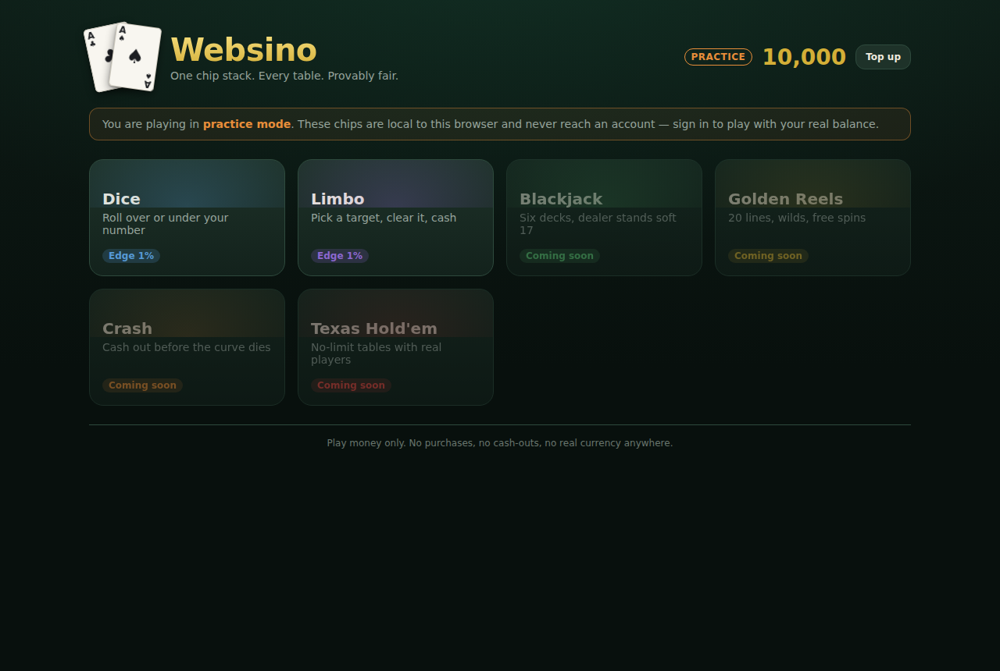

It is a ground-up TypeScript rewrite of [pysino](https://github.com/candycain5432/pysino),
a Python/pygame desktop casino. The rules and the tuning carried over — they were the
valuable part — and everything else was rebuilt for the web: real accounts, a server that
deals the cards, a design system instead of a blitted canvas, and a build you can open
from a file on a plane.

---

## Quick start

```bash
pnpm install
pnpm dev          # client on :5173, server on :3000
```

Then open <http://localhost:5173>. Create an account to play against a server-held
balance, or take the practice door and play offline with no account at all — the games
are identical either way, because both run the same engine behind the same interface.

```bash
pnpm test         # 522 tests
pnpm -r typecheck
pnpm build        # static client bundle
```

Node 22+ and pnpm 10+.

---

## What's here

| | |
|---|---|
| **Games** | Texas Hold'em, Blackjack, Roulette, Golden Reels (slots), Jacks or Better, Mines, Crash, Dice, Limbo |
| **Multiplayer** | Shared hold'em tables over WebSocket — six seats, server-held turn clock, bots filling the empties |
| **Accounts** | Username + password, argon2id, server-authoritative chips |
| **Fairness** | HMAC-SHA256 commit/reveal with an in-app verifier |
| **Offline** | Practice mode with a local wallet; a single-file build that runs from `file://` |
| **Tests** | 522, covering payout maths, chip conservation and seed secrecy |

Plinko, Hi-Lo, Towers, Wheel of Fortune and shared-table blackjack and roulette are next
— see [Roadmap](#roadmap).

---

## The games

### Texas Hold'em

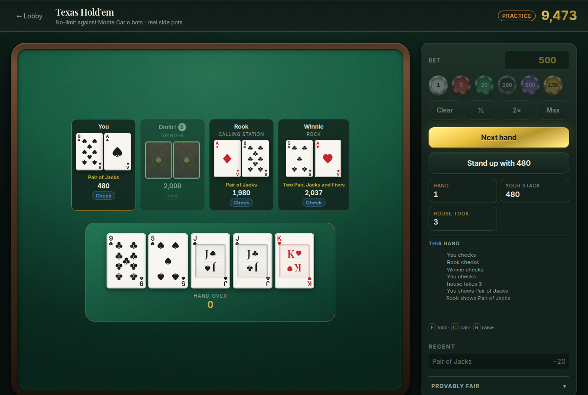

A full no-limit cash game against three Monte Carlo bots: blinds, four betting streets,
short-stack all-ins and properly layered side pots. Each bot gets a name and a
personality — a Rock, a Shark, a Maniac, a Calling Station, a Grinder — and estimates its
equity by simulating the rest of the hand a few hundred times, then mixes that with pot
odds and its own temperament.

**Chip conservation is the headline invariant, and it is asserted after every single
action.** pysino's hold'em minted 4,918 chips from a refund of a buy-in that had never
been debited, so here the total across every seat plus the pot is checked before a hand,
after each action, and after settlement, across sixty bot-vs-bot hands. Settlement clears
commitments as it pays, because otherwise the same chips would sit in two columns at once
and the total would silently double.

Your buy-in is debited when you sit and your stack credited when you stand up — the two
halves of one session, in one file, so a refund without a matching debit is not reachable.

Side pots walk *contribution levels* rather than players, which is the only way short
stacks and folds compose correctly: a folded player's chips stay in the pot they paid
into, they simply cannot win it. Consecutive layers contested by the same seats merge, or
a player folding their blind would look like it created a side pot.

Bots take a `CasualSource`. Handing one the fair stream is a **compile error**, not a code
review catch — pysino's equity estimator drew from the deal's own generator, so a bot
thinking perturbed the cards still to come.

**The house takes a rake**: 5% of the pot, capped at 3 big blinds, and **no flop, no
drop** — a hand that ends before the flop is free, because otherwise players pay to fold
their blinds, which is the one thing that genuinely drives people off a table.

This exists to fix a real economy hole rather than for flavour. Bots rebuy with
house-funded stacks, so without a rake a table was a *source* of chips: beat the bots,
cash out, and you had taken chips that were created for you. Hold'em was also the only
game here with no house edge, while everything else takes between 0.5% and 5%. A rake is
how an actual card room solves exactly this, and it makes the table consistent with the
rest of the casino.

It is shown, not hidden — the felt says what the house took — and it is the *only* way
chips may leave a table. That makes the tested invariant an exact one: chips on the felt
plus chips the house has taken may only change when somebody sits down or stands up.

### Shared tables

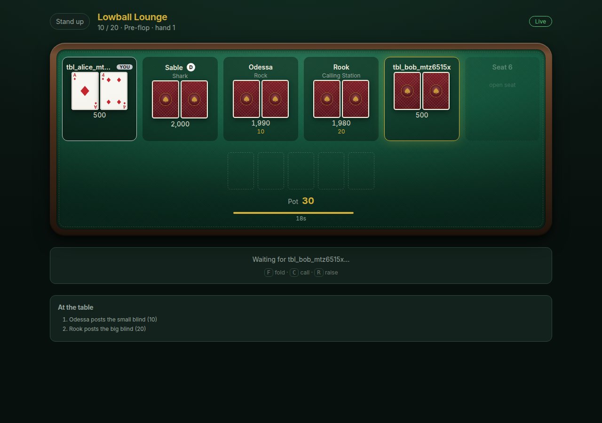

The same hold'em, with other people in the seats. Six seats per table, and an account
holds at most one seat across the whole floor — enforced by a unique index, so you cannot
play yourself.

**The server owns the clock.** A shared table is *live*: it advances on a timer whether or
not anyone is looking, because somebody else's twenty seconds are running. Every turn
carries a deadline the server set and broadcast, so every browser counts down to the same
instant rather than to its own idea of when the turn began. On expiry the seat checks if
it can and folds if it cannot — the only action that cannot commit chips the player did
not choose to commit.

**The client sends intents and nothing else.** `sit here`, `call`, `stand up`. It never
says when it acted, what it holds or what it is owed, and every reply is a freshly built
per-viewer snapshot. Hole cards are *absent* from a payload that has not earned them —
not blanked, not nulled — so there is nothing for a patched client to reveal. Two browsers
at one table are driven headlessly on every change to assert exactly that, in the DOM and
in the raw payload.

**Snapshots, not diffs.** Reconnecting is the normal case here — a phone locks, a laptop
sleeps — and a diff protocol needs a story for the client that missed one. Sending the
whole room makes "did we drop a frame" a question that cannot arise, and makes the first
message after a reconnect the current truth.

**Disconnecting does not free your chips.** They stay in the pot, the clock keeps running,
and reconnecting inside a minute restores the seat exactly. The alternative is a player
escaping a bad spot by pulling a cable. Past the grace period the seat is stood up and the
stack goes back to the wallet.

**Standing up mid-hand is queued, not refused.** Chips in a live pot cannot come back —
they may yet be lost — so the request is taken and honoured the moment the hand ends. The
first version refused it outright, which sounds principled and means clicking into the
four-second gap between hands and hoping.

Two things a shared table must never do, both tested: stand up a folded player mid-hand
(their `committed` chips are still in the live pot, so clearing them would shrink the pot
and destroy chips), or let the table total change while the same people are just playing
cards. Bots are house-funded and a busted one is replaced, so the felt is not a closed
system — but a chip may only ever appear on a tick where the seating actually changed.

Rooms are snapshotted to SQLite after every mutation, for the same reason single-player
sessions are: a seat's buy-in has already left a wallet, so a restart that lost the room
would strand real stacks.

### Roulette

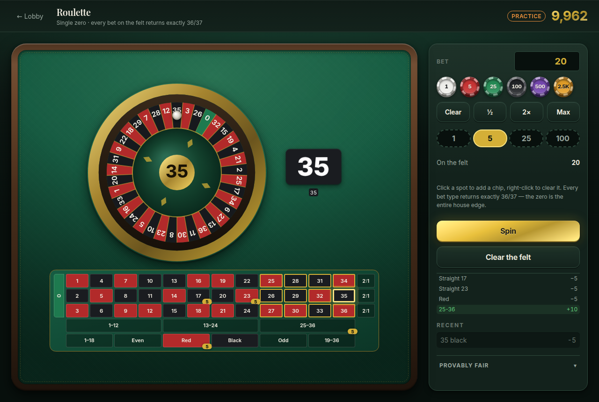

The complete single-zero felt: straights, splits, streets, corners, six lines, columns,
dozens and all six even-money bets. Click a spot to add a chip, right-click to clear it.

**Every bet type returns exactly 36/37**, and there is no house-edge constant anywhere in
the file. On a 37-pocket wheel a bet covering `n` numbers pays `36/n - 1` to one, so one
formula handles the whole felt and the 2.70% edge falls out of the zero being on the wheel
but inside no bet's coverage. The tests sum the return over all 37 pockets for each of the
fifteen bet types and get exactly `36 × stake` every time — by enumeration, not simulation.

Bets travel as a **type plus a selection**, never as a raw set of numbers, and the engine
builds the canonical set itself. A split has to name two numbers that actually touch on
the layout; a corner has to be anchored somewhere a 2×2 block exists. Coverage-derived
odds mean an invented set would not pay any better, but "the client may describe its own
wager" is not a property worth having.

### Mines

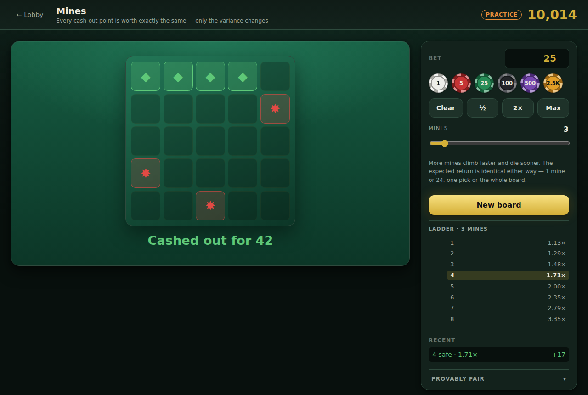

A 5×5 grid, between 1 and 24 mines, uncover gems and cash out before you hit a bomb.

The multiplier after `k` safe picks is the exact inverse of the probability of getting
that far, scaled by the edge — so **every cash-out point is worth exactly the same 0.99**.
One pick and clearing the whole board have identical expected value; only the variance
differs. The tests assert that identity to twelve decimal places, for every mine count at
every depth.

The board is laid at the start and the map stays on the server: revealing is one request
per tile. Sending the grid and asking the UI not to look would make the game a formality.

The board also comes from a single `shuffle` of the 25 tiles rather than a sample of
`mines` positions, so a round consumes the same number of draws whatever the mine count —
the stream position afterwards cannot leak how the player configured it.

### Jacks or Better

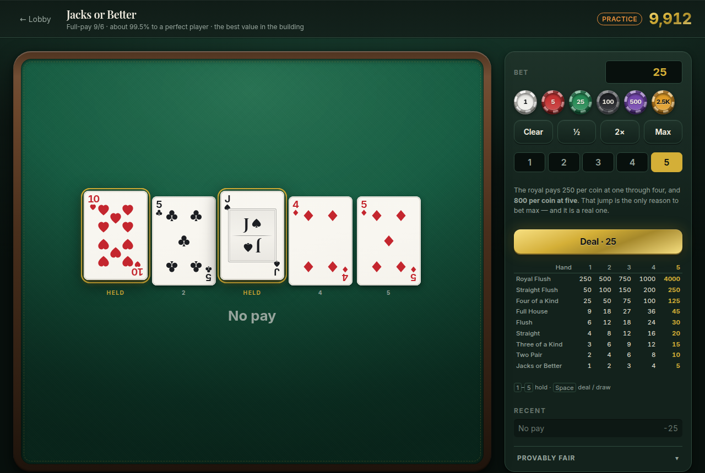

Full-pay 9/6 video poker — nine for a full house, six for a flush — worth about 99.5% to a
perfect player and comfortably the best value in the building. The royal jumps from 250 per
coin to 800 at five coins, which is the only reason to ever bet max, and a real one.

The whole deck is shuffled at the deal, so the replacements are fixed *before* the player
chooses what to hold. That is what stops the draw being chosen after seeing the holds, and
it means one `(serverSeed, clientSeed, nonce)` replays the entire hand rather than just the
first five cards. The undrawn deck never leaves the server.

`Ask for the best play` scores all 32 hold patterns. It takes a plain `() => number` and
therefore *cannot* be handed the fair stream — the structural fix for pysino's bug, where
pressing the hint button perturbed the very cards it was advising about.

The tests check dealt-hand frequencies against the exact five-card poker odds rather than
measuring return to player. RTP here is dominated by royal flushes at roughly 1 in 40,000,
so any sample small enough for CI is really measuring whether a royal happened to land — an
earlier version of that test failed at 115% having caught one. Measured separately over
20,000 played hands with the sampling hint: **96.84%**, against 99.54% for perfect play.

### Blackjack

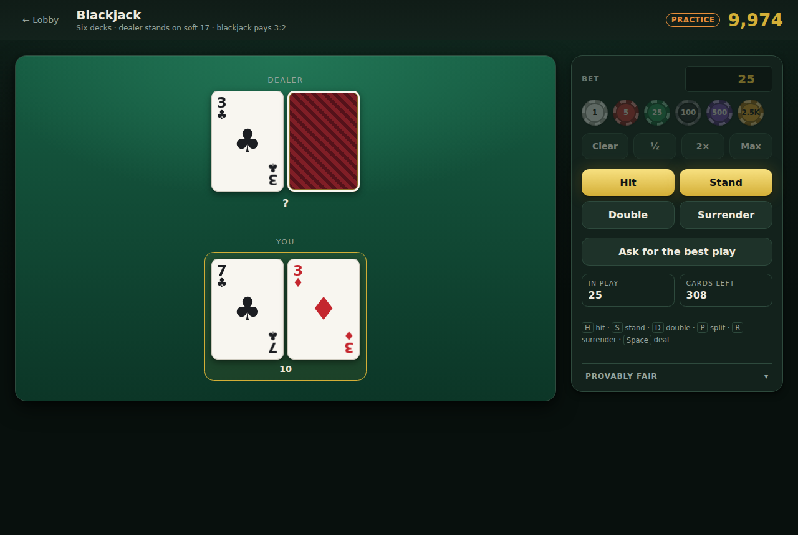

Six decks, dealer stands on soft 17, blackjack pays 3:2, double on any two cards, double
after split, split to four hands, split aces take one card each. Insurance is offered
against an ace and late surrender is available on the first two cards.

`H` `S` `D` `P` `R` play the hand from the keyboard, and **Ask for the best play** gives
textbook basic strategy restricted to the moves actually legal in the position — so the
advice is never something the table would refuse. That hint is a pure function of what is
face up; it draws from no random source at all, which is the structural fix for a bug
`pysino` shipped, where asking for advice perturbed the very cards it was advising about.

The commitment is per **shoe**, not per round. One stream shuffles all 312 cards and
hands deal from it in order. Committing per round would be weaker, not stronger: it would
leave the house free to reshuffle between hands, which is the one thing a blackjack
player actually needs ruled out.

The dealer's hole card is **absent** from the payload while it is face down — not sent
and hidden by the UI. A player with the network tab open learns exactly as much as one
without.

### Golden Reels

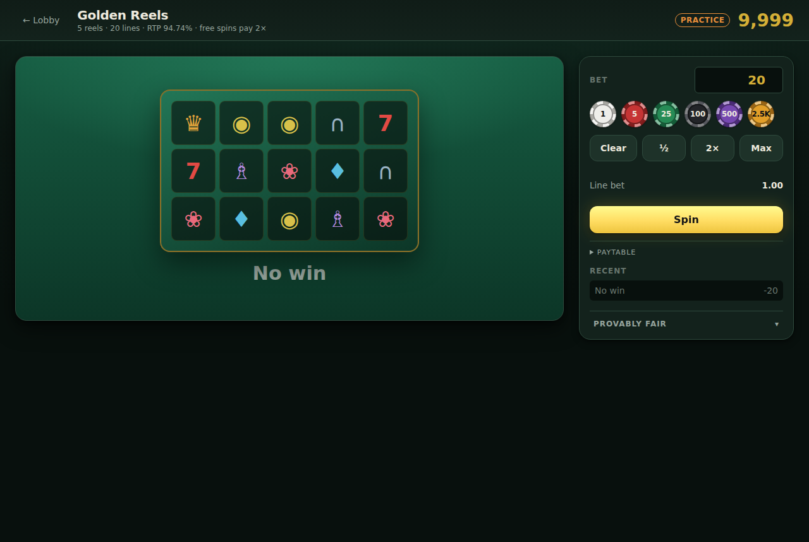

Five reels, three rows, twenty paylines, each reel with its own weighted strip. Wilds
substitute for everything except scatters, and three or more scatters anywhere buy free
spins that pay double and can retrigger.

**RTP is exactly 94.7374%, and the test pins it to six decimal places.** That is worth a
paragraph, because a slot's return is dominated by rare events — the bonus fires about
once in 120 rounds — so simulating it is nearly useless: at 200,000 rounds this machine
reads 96.2%, and at 400,000 it reads 95.2%. `pysino` could only assert a band from 0.88
to 1.02 for exactly this reason.

The closed form is computable because for any fixed payline the symbol on each reel is
uniform over that reel's strip and independent across reels, so one line's expected value
is a finite sum over 9⁵ combinations, and expectation is linear across the twenty lines
even though the lines are correlated. Scatters are *not* independent within a reel — three
visible rows come from one stop — so their distribution comes from scanning every stop and
convolving across reels. Change a weight or a paytable entry and the test says so.

Free spins resolve **inside the round that triggered them** rather than being held as
state between requests, which keeps slots a true one-shot game: one ledger transaction,
plain HTTP, and a return that can be asserted per round rather than per session.

### Crash

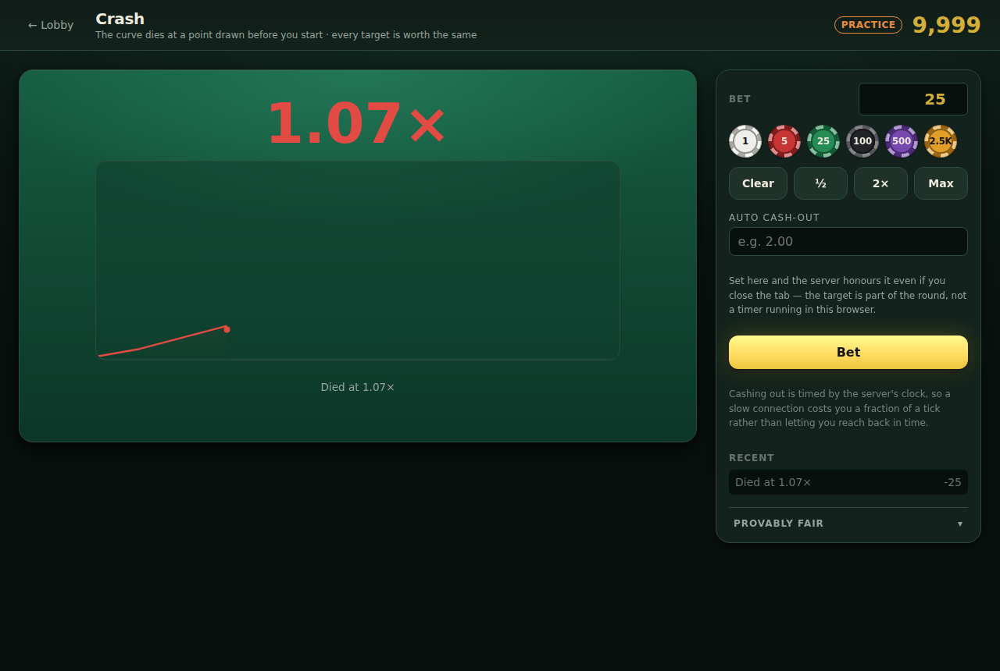

A multiplier climbs from `1.00×` and dies at a point drawn before you start. Cash out
first or lose the stake. Auto cash-out is part of the round rather than a timer in your
browser, so the server honours it even if you close the tab.

The curve is a pure function of an integer tick index. `pysino` advanced a float
`elapsed` by a frame delta and compared two rounded floats, so whether the curve *reached*
the crash point depended on frame timing — the same seed could pay differently on a slow
machine.

Ticks only schedule the animation; they never decide a payout. Taking value `v` wins when
`v ≤ crashPoint`, and since `P(crashPoint ≥ v) = 0.99 / v` exactly, paying `v` on that
event makes the expected return exactly 99% at **every** target. Letting the tick grid
arbitrate instead breaks that twice over — a 2.00× target settles against the 2.02× the
tick actually reached, and a crash point that floors to exactly `1.00×` (2/101 of rounds,
not 1/100) takes the whole stake instead of pushing. Both were real bugs in the first
version of this module, both caught by tests, and together they were worth about a full
percentage point of house edge.

Your cash-out is timed by the **server's** clock. You say only *that* you cashed out; the
server dates the request. Latency therefore costs you a fraction of a tick rather than
letting you reach back in time.

### Dice

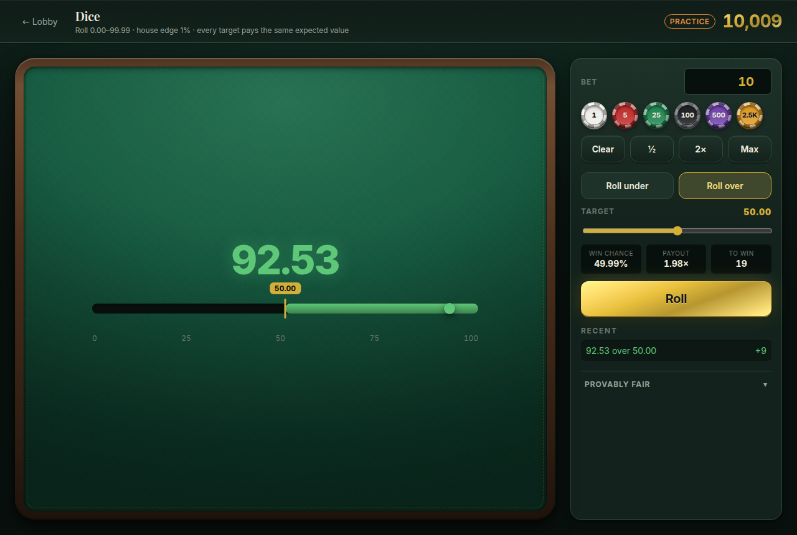

Roll `0.00`–`99.99`, bet on over or under a target you choose. The payout is always
`0.99 / winChance`, so **every target has identical expected value** — picking a 2% shot
instead of a 90% one changes your variance, not the house's edge. The tests assert that
exactly rather than statistically.

### Limbo

A multiplier is drawn; you win if it reaches your target. The draw satisfies
`P(result ≥ x) = 0.99 / x`, which is the same distribution Crash uses — Limbo is simply
Crash without the waiting, which made it the ideal game to prove the whole pipeline with.

---

## Provably fair

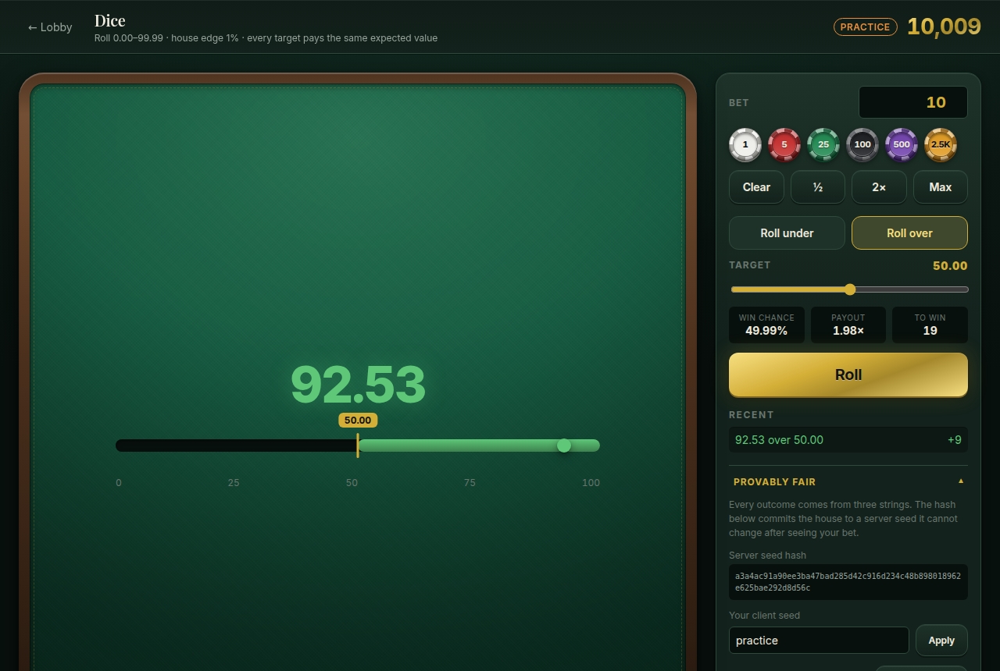

Every outcome comes from three strings:

```
block(i) = HMAC-SHA256(serverSeed, `${clientSeed}:${nonce}:${i}`)
```

Before you bet, the house publishes `sha256(serverSeed)` — a commitment it cannot wriggle
out of afterwards. You pick the `clientSeed`, which is mixed into every draw, so the house
cannot pre-screen server seeds that happen to be bad for you. Rotating the seed reveals
the old one, and any past round can then be recomputed and checked.

The full scheme is in [`packages/fair/SPEC.md`](packages/fair/SPEC.md) — about 40 lines of
rules, with frozen golden vectors so a refactor cannot silently change what players would
have won.

**Being straight about the limits.** This is play money on a server the operator runs. It
proves the seed was not swapped after seeing your bet, and it makes every round exactly
reproducible — genuinely useful for auditing and for debugging a hand that "should have
won". It is not a defence against an operator who modified the server before committing.
Treat it as craft, not as a guarantee.

---

## Offline

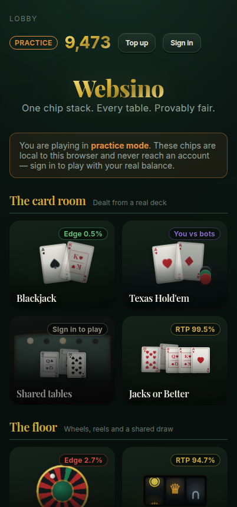

Two ways to play with no network:

```bash
pnpm --filter @websino/web build:offline   # one 188 KB HTML file
```

The result is a single `dist-offline/index.html` you can double-click. (A normal bundle
cannot do this: Chrome blocks ES module imports over `file://` via CORS, which is why the
single-file build exists. `tools/shots/offline.mjs` verifies it actually plays, because
that is exactly the kind of thing that fails silently.)

**Practice chips never sync.** They live in this browser and never reach an account.
There is no cryptographic fix for "play offline, edit localStorage, press upload" — the
client owns the machine — so offline exists to let you play on a plane, not to farm
currency. Achievements and leaderboards will only ever count online play.

---

## How it fits together

```
packages/
  fair/      the provably-fair primitives + the normative SPEC.md
  engine/    pure rules. No I/O, no randomness source. Runs on server AND client.
apps/
  server/    Fastify + SQLite. The only thing that deals.
    rooms/   shared tables: seats, the turn clock, and both halves of every chip move
  web/       Vite + React. DOM and CSS, canvas reserved for effects.
tools/
  sim/       long-run RTP simulation with sigma error bars
  shots/     headless screenshots, doubling as a smoke test
```

Three decisions carry most of the weight:

**The engine ships to both sides, the secrets do not.** `packages/engine` holds rules —
payout maths, legal-move validation, hand evaluation. It holds no randomness and no
authority. The server owns the seed and computes every outcome; the client re-uses the
same rules to render and to grey out illegal buttons, and the server re-validates
everything regardless. Cheating is prevented by redaction, not by obfuscation.

**One transport interface, two implementations.** Game screens talk to a `GameTransport`
and never learn whether it is an authoritative server or the local dealer in this tab.
That is what stops offline mode from becoming a second, drifting copy of the casino.

**A table's chips move in exactly two places.** `join` debits the buy-in and seats the
player with it; `leave` credits whatever stack is left and empties the seat. Neither is
reachable without the other, and every exit — standing up, a queued leave, a grace period
expiring — goes through the same function, so they cannot disagree about how much came
back.

**Chips move through exactly one function.** `applyLedger` writes append-only rows;
`wallets.chips` is only ever a cache of `SUM(ledger.delta)`, and `auditBalances()` asserts
they agree. pysino shipped a bug where hold'em refunded a buy-in that had never been
debited, minting 4,918 chips from nothing — this makes that class of bug a failing audit
instead of a silent gift.

---

## Testing

```bash
pnpm test                         # everything
npx tsx tools/sim/rtp.ts 500000   # long-run RTP, run when changing payout maths

# Browser verification. Each needs a built client; the last two need a running server.
node tools/shots/capture.mjs      # every screen on the local dealer, plus card geometry
node tools/shots/offline.mjs      # the single-file build, played from file://
node tools/shots/online.mjs       # every game against a real server, asserted in the ledger
node tools/shots/tables.mjs       # two browsers at one shared table
```

The interesting tests are the invariants, not the line coverage:

- **Payout maths** — dice and limbo return ~0.99 at every target over 60k rounds each, and
  the EV identity is asserted exactly, not just statistically.
- **No modulo bias** — a chi-square test over `randBelow(37)`, the exact place where naive
  `uint32 % n` develops measurable bias.
- **Shuffle spread** — every card must reach every position, which catches the classic
  Fisher-Yates off-by-one that leaves one index under-mixed.
- **Chip conservation** — 200 rounds, then assert wallet equals ledger sum; plus a check
  that a failed multi-entry round leaves nothing behind.
- **Seed secrecy** — every client-bound payload is searched for the active server seed.
- **Independent replay** — a finished round is recomputed from the revealed seed the way
  the verifier does, and must match what the house reported.
- **Frozen vectors** — fixed seeds produce pinned outputs forever, so changing outcomes
  has to be deliberate.
- **Shared tables, clock driven by hand** — a twenty-second turn timer and a sixty-second
  disconnect grace are untestable in real time, so the tests advance `tick(now)` with an
  explicit instant instead of sleeping.
- **Two real browsers, one table** — the one claim no unit test can make. Two Chromium
  contexts, two sessions, one server: each sees the other by name, each sees two face-up
  cards and card backs everywhere else, one player's action appears in the other's browser
  without a reload, and standing up lands as a payout row in the server's own ledger.
- **No colliding CSS blocks** — the client ships one global stylesheet, so a new screen
  reusing a class name another screen owns silently inherits its layout. This shipped
  once (`.felt` was roulette's betting grid and the tables screen claimed it too) and is
  now a failing test rather than a confusing screenshot.

---

## Roadmap

- [x] Fairness core, engine, accounts, ledger, design system, Dice + Limbo, offline
- [x] Blackjack, slots, crash — plus the HTTP transport that connects the client to the
      server, and sign-in
- [x] Mines, video poker, solo roulette
- [ ] Plinko, Hi-Lo, Towers, Wheel of Fortune (solo), slots variety pack
- [ ] Bingo as a shared round
- [x] Hold'em against bots, with a rake so the table is a sink rather than a faucet
- [x] Shared tables: several humans at one hold'em table
- [ ] Shared-table blackjack and roulette
- [ ] Leaderboards, profiles, achievements, XP and levels
- [ ] PWA install, sound, animation pass

---

## Decisions worth knowing about

Two questions came up while building the shared tables that were genuinely open. Both are
settled now, and both are cheap to revisit.

**Bingo is a shared round; Wheel of Fortune is solo.** Multiplayer was scoped to
Hold'em, Blackjack and Roulette, and both of these looked like they contradicted that.
They do not have to. Wheel of Fortune is a weighted spin with no other players in it —
mechanically a slot, and perfectly good solo, so it adds no multiplayer surface at all.
Bingo genuinely is pointless alone; the whole game is the race. So it becomes a *shared
round* rather than a shared table: everyone buys cards, one ball sequence is drawn for
all of them, first to a pattern wins. That needs no seats, no turn clock and none of the
hold'em machinery — it reuses the room tick and nothing else.

**Bots stay a chip faucet, and the rake is the counterweight.** Removing bot rebuys
would starve tables, and capping them is fiddly for no real gain. Taking a rake instead
means a player has to beat both the bots and the house cut to profit, which is the same
deal every other game in the casino already offers. See
[Texas Hold'em](#texas-holdem) for the numbers.

---

## Licence

MIT. The chips are not real, cannot be bought, and are worth exactly nothing.
